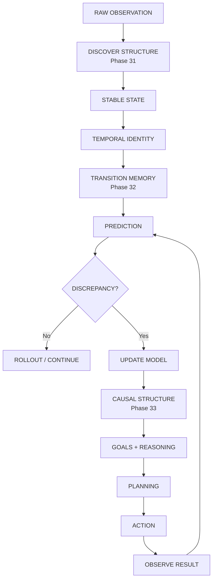
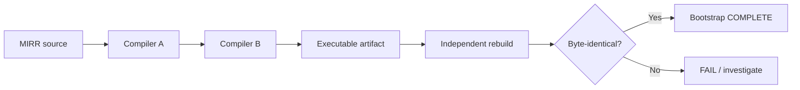
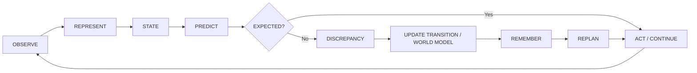
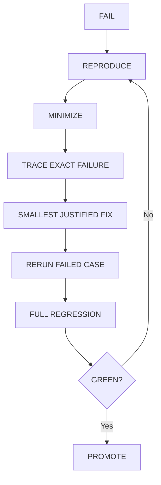
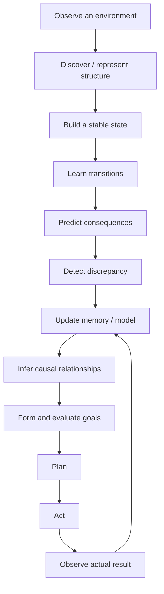
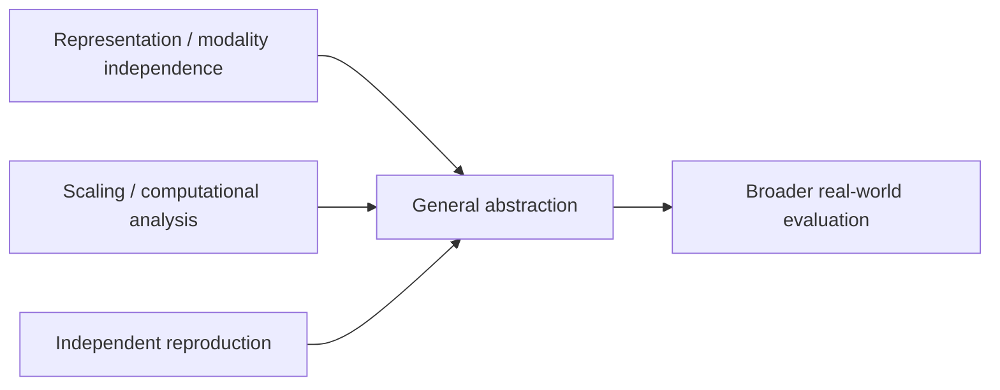

# MIRROR 7

> **An open-source research architecture for explicit representation, state, prediction, reasoning, memory, planning, and self-hosted computation.**

[](./BOOTSTRAP_PROGRESS.md)
[](./phase31_bootstrap)
[](./phase32_prediction)
[](./INDEPENDENT_EVALUATION_2026-09-19.md)
[](./LICENSE)

---

## 🧭 What is Mirror 7?

Mirror 7 is a research project exploring an alternative route toward machine intelligence:

```text
raw observation
      ↓
discover structure
      ↓
stable state
      ↓
temporal identity
      ↓
transition memory
      ↓
prediction
      ↓
discrepancy
      ↓
causal / world-model update
      ↓
goals + reasoning
      ↓
planning
      ↓
action
      ↓
observe result
      ↺
learn / revise / remember
```

The project emphasizes **explicit, inspectable mechanisms** wherever the research question permits, rather than assuming that intelligence must be implemented as next-token prediction.

> **Important boundary:** a passing phase demonstrates the tested mechanism and its acceptance criteria. It does **not** by itself prove AGI, human-level intelligence, consciousness, or general-world competence.

---

## 🟢 Current Project Status

### Verified boundary

| Area | Current state |
|---|:---:|
| Self-hosting / compiler bootstrap | ✅ Complete |
| Representation discovery | ✅ Verified |
| State + temporal identity | ✅ Verified |
| Transition memory + prediction | ✅ Verified |
| Causal reasoning | ✅ Verified |
| Reasoning / planning mechanism | ⚠️ Source-artifact gap remains |
| Action + closed loop | ✅ Verified |
| Memory | ✅ Verified |
| World model | ✅ Verified |
| Composition | ✅ Verified |
| Hierarchical planning | ✅ Verified |
| Tools | ✅ Verified |
| Language grounding | ✅ Verified |
| Counterfactuals | ✅ Verified |
| Continual learning | ✅ Verified |
| Meta-reasoning | ✅ Verified |
| Robustness / transfer | ✅ Verified |
| Full integration | ✅ Verified |
| Advanced reasoning | ✅ Verified |
| Open-ended black-box learner | ✅ Implemented |
| Phase 53 blind benchmark | ✅ 21/21 |
| Phase 54 locked fresh evaluation | ✅ 18/18 |
| Phase 54 held-out | ✅ 9/9 |
| Phase 54 invalid actions | ✅ 0 |

### Current frontier

There is **no formal Phase 55 acceptance specification in the repository yet**. The next research boundary should be chosen from the unresolved scientific gaps rather than inventing a phase number prematurely.

---

## 🧠 The Mirror 7 Capability Stack



The later capability layers extend the same loop with:

```text
memory
  + world model
  + composition
  + hierarchy
  + tools
  + language grounding
  + counterfactual simulation
  + continual learning
  + meta-reasoning
  + robustness
  + transfer
```

---

## 🔬 What has actually been demonstrated

### 1. Computational substrate / bootstrap

Phases 24–30 established the self-hosting compiler substrate:



Recorded reproducibility identifiers:

- Primary artifact SHA256: `ec48f82db766b3fa4bbcad83bc5f9193aedb2212329122e8b380a1a68d3a5c50`
- Independent rebuild SHA256: `ec48f82db766b3fa4bbcad83bc5f9193aedb2212329122e8b380a1a68d3a5c50`
- Fixed-point compiled-B SHA256: `4d395c63b6e4364fcad2f198e74e305b639996cc649bbf58d66bb2e46e597d25`

See:
- [Bootstrap progress](./BOOTSTRAP_PROGRESS.md)
- [Detailed status](./STATUS.md)

### 2. Representation → prediction

Phases 31–32 established:

```text
raw observation
      ↓
structural discovery
      ↓
stable state
      ↓
temporal identity
      ↓
learned transition
      ↓
next-state prediction
      ↓
discrepancy
      ↓
online update
```

Phase 31 acceptance: **37/37 tests passed**.

Phase 32 covers multi-seed validation, held-out cases, ambiguity, online learning, rollout, perturbation testing, serialization, integration, and regression.

### 3. Causal → planning → action

The Phase 33–51 capability line demonstrates explicit mechanisms for:

```text
CAUSE
 ↓
GOAL
 ↓
REASON
 ↓
PLAN
 ↓
ACT
 ↓
MEMORY
 ↓
WORLD MODEL
 ↓
COUNTERFACTUAL
 ↓
REVISE
```

See [Phase 35–51 verification](./PHASE35_51_VERIFICATION.md).

### 4. Open-ended black-box learning

Phase 52 provides a learner that receives only:

```text
observation
goal
legal actions
step limit
transition feedback
```

It does not receive task-family labels, hidden parameters, or expected transitions.

The learner discovers action consequences online, predicts effects, updates memory, and replans.

See [Phase 52 runtime](./phase52_open_learning/README.md).

### 5. Blind generalization

Phase 53:

- 21/21 benchmark episodes solved
- 12/12 held-out episodes solved
- 0 invalid actions

See [Phase 53 report](./PHASE53_REPORT.md).

### 6. Phase 54 fresh evaluation

The locked Phase 54 evaluator uses six fresh task families with randomized opaque action identifiers.

Result:

```text
Training:     9 / 9
Held-out:     9 / 9
Overall:     18 / 18
Invalid:       0
```

Evaluator SHA256:

```text
c821c963ab8b80f5a28611c79f971deec6133eeee9836d210f293f325fcaed7c
```

The evaluator remained unchanged while the learner was fixed.

See [Phase 54 evaluation](./INDEPENDENT_EVALUATION_2026-09-19.md).

---

## 🔁 The Core Learning Loop



This loop is the central architectural idea behind the project.

---

## ✅ Verification Philosophy

Mirror 7 follows a strict promotion rule:

```text
IMPLEMENT
   ↓
FOCUSED TEST
   ↓
PROGRESSIVE TESTS
   ↓
MULTI-SEED
   ↓
HELD-OUT / UNSEEN
   ↓
ADVERSARIAL CONTROL
   ↓
FULL REGRESSION
   ↓
PROMOTE ONLY IF GREEN
```

When something fails:



Rules:

- Do not weaken an evaluator to obtain PASS.
- Do not remove failing seeds.
- Do not hardcode benchmark answers.
- Do not leak hidden task information into the learner.
- Do not call a toy benchmark result AGI evidence.
- Keep implementation, verification, integration, and research claims separate.

---

## 📊 Phase Map

<details>
<summary><strong>Phases 24–30 — Bootstrap</strong></summary>

| Phase | Result |
|---|:---:|
| 24 | ✅ Runtime dictionary |
| 25 | ✅ Tokenization / lookup / compilation |
| 26 | ✅ Native compiler path |
| 27 | ✅ Structured relocation / control flow |
| 28 | ✅ Surface parser/compiler integration |
| 29 | ✅ MIRR source closure |
| 30 | ✅ Compiler entirely in MIRR |
| Bootstrap chain | ✅ Self-recompile / fixed-point / independent rebuild |

</details>

<details>
<summary><strong>Phases 31–34 — Intelligence Foundations</strong></summary>

| Phase | Result |
|---|:---:|
| 31 | ✅ Representation / state / temporal identity |
| 32 | ✅ Prediction / transition memory / discrepancy |
| 33 | ✅ Causal structure / interventions |
| 34 | ⚠️ Verification reported; dedicated source artifact still missing |

</details>

<details>
<summary><strong>Phases 35–51 — Capability Expansion</strong></summary>

| Phase | Capability | Result |
|---|---|:---:|
| 35 | Action model | ✅ |
| 36 | Closed loop | ✅ |
| 37 | Working memory | ✅ |
| 38 | Episodic memory | ✅ |
| 39 | World model | ✅ |
| 40 | Composition | ✅ |
| 41 | Hierarchical planning | ✅ |
| 42 | Tool use | ✅ |
| 43 | Language grounding | ✅ |
| 44 | Counterfactual simulation | ✅ |
| 45 | Continual learning | ✅ |
| 46 | Meta-reasoning | ✅ |
| 47 | Efficiency mechanisms | ✅ |
| 48 | Robustness | ✅ |
| 49 | Transfer | ✅ |
| 50 | Complete integration | ✅ |
| 51 | Advanced reasoning | ✅ |

See [full Phase 35–51 verification](./PHASE35_51_VERIFICATION.md).

</details>

<details>
<summary><strong>Phases 52–54 — Generalization Boundary</strong></summary>

| Phase | Result |
|---|:---:|
| 52 | ✅ Open-ended black-box learner |
| 53 | ✅ Internal blind benchmark — 21/21 |
| 54 | ✅ Fresh locked evaluator — 18/18 |
| Phase 54 held-out | ✅ 9/9 |
| Phase 54 invalid actions | ✅ 0 |

</details>

---

## 🚧 What is still unsolved

Passing the current gates does **not** mean the project has reached AGI.

The major open research problems are:

### Representation independence

Can Mirror 7 discover useful structure when the observation encoding changes substantially?

### Raw-world concept acquisition

Can it discover entities, relations, events, and useful state from raw mixed-modality input without developers hand-defining the ontology?

### Scaling

How does search and memory behave as:

```text
entities ↑
hypotheses ↑
state size ↑
planning depth ↑
distractors ↑
```

### Long-horizon autonomy

Can the system maintain reliable model → plan → act → observe → revise loops across much longer tasks?

### Strong abstraction

Can a computational principle learned in one environment transfer to another environment where the surface semantics are substantially different?

### Continual learning at scale

Can it acquire large amounts of new knowledge without corrupting old knowledge?

### Real-world grounding

Can the mechanisms operate robustly with external language, tools, files, sensors, and dynamic environments?

### Compute efficiency

What is the actual runtime/memory/sample-efficiency profile compared with strong neural baselines?

### Safety and reliability

Can failure, uncertainty, bad actions, model corruption, and irreversible outcomes be detected and contained?

### Independent reproduction

Can an unrelated implementation/team reproduce the important results from the frozen repository?

---

## 🎯 What Mirror 7 can do today

At the demonstrated boundary, Mirror 7 can:



It also has tested mechanisms for:

- working and episodic memory;
- world-model updates;
- compositional reasoning;
- hierarchical planning;
- counterfactual simulation;
- tool execution;
- language-to-structure grounding;
- continual learning;
- epistemic bookkeeping and contradiction checks;
- open-ended action-effect discovery;
- generalization to unseen benchmark task families.

The **scope statement** is important: these capabilities are demonstrated in bounded, structured research environments and should not be read as a claim that Mirror 7 already has unrestricted real-world intelligence.

---

## 🧪 Research Boundaries & Known Caveats

### Phase 34 artifact gap

Phase 34 reasoning/planning was reported as verified in the project workflow, but the supplied source artifact did not contain a dedicated Phase 34 implementation directory. The repository therefore keeps this boundary explicit rather than manufacturing a source-code claim.

### Phase 51 benchmark caveat

Several Phase 51 comparison values are synthetic/mock baseline values. The mechanism and executable gate are verified, but those values are not treated as independent scientific comparison results.

### Phase 54 independence caveat

Phase 54 is an **independent-style** evaluation, not a third-party scientific replication. The evaluator was kept outside the learner implementation and remained locked, but both benchmark construction and learner development occurred within the same broader project workflow.

---

## 📚 Where to go next

| Document | Purpose |
|---|---|
| [STATUS.md](./STATUS.md) | Detailed acceptance board and evidence |
| [ROADMAP.md](./ROADMAP.md) | Capability roadmap and remaining research gaps |
| [BOOTSTRAP_PROGRESS.md](./BOOTSTRAP_PROGRESS.md) | Bootstrap / self-hosting chain |
| [PHASE35_51_VERIFICATION.md](./PHASE35_51_VERIFICATION.md) | Phase 35–51 verification record |
| [PHASE53_REPORT.md](./PHASE53_REPORT.md) | Phase 53 blind benchmark |
| [INDEPENDENT_EVALUATION_2026-09-19.md](./INDEPENDENT_EVALUATION_2026-09-19.md) | Phase 54 locked evaluation |
| [phase52_open_learning/](./phase52_open_learning/) | Open-ended learner |
| [phase53_independent_eval/](./phase53_independent_eval/) | Blind evaluator |
| [LICENSE](./LICENSE) | Project license |

---

## ▶️ Running the project

The repository contains multiple phase-specific gates. Start with the relevant phase documentation rather than assuming one global command covers the entire project.

For the open-ended learner:

```bash
python -m pytest phase52_open_learning -q
```

For the Phase 53 evaluator:

```bash
python -m pytest phase53_independent_eval -q
```

For the Phase 32 acceptance gate:

```bash
python phase32_prediction/test_phase32_gate.py
```

See the individual phase READMEs and [STATUS.md](./STATUS.md) for the authoritative verification boundary.

---

## 🌱 Research Direction

The next milestone should not simply be “more benchmark rows.”

The strongest next question is:

> **Can Mirror 7 discover and reuse a computational abstraction when both the surface representation and task semantics change, while remaining computationally viable as the environment scales?**

That points toward three connected research tracks:



Only after those experiments should the project commit to a specialized new runtime, language, compiler, or hardware substrate.

---

## 🛡️ License

Mirror 7 is released under the **Apache License 2.0**.

The repository contains the full license text in [LICENSE](./LICENSE).

Official license reference: https://www.apache.org/licenses/LICENSE-2.0

---

## 📌 Project Principle

```text
DO NOT ASK:
"How many features can we add?"

ASK:
"What general mechanism has actually been demonstrated?"
```

Mirror 7 is an ongoing research program.

The repository should always make it easy to distinguish:

```text
implemented
   ≠
verified
   ≠
integrated
   ≠
generalized
   ≠
independently reproduced
   ≠
AGI
```

That distinction is part of the project itself.
