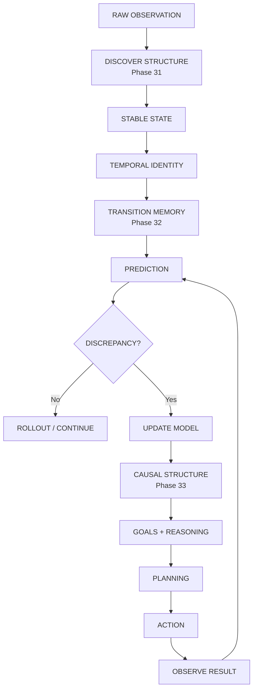
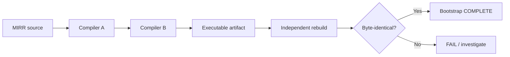
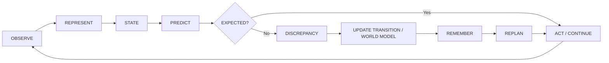
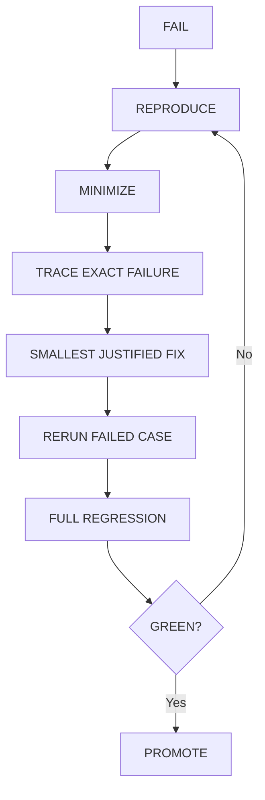

# MIRROR 7

> **An open-source research architecture for explicit representation, state, prediction, reasoning, memory, planning, and self-hosted computation.**

[](./BOOTSTRAP_PROGRESS.md)
[](./phase31_bootstrap)
[](./phase32_prediction)
[](./INDEPENDENT_EVALUATION_2026-09-19.md)
[](./PHASE55_ACCEPTANCE.md)
[](./PHASE56_ACCEPTANCE.md)
[](./PHASE57_ACCEPTANCE.md)
[](./PHASE58_ACCEPTANCE.md)
[](./PHASE59_ACCEPTANCE.md)
[](./PHASE60_ACCEPTANCE.md)
[](./PHASE61_ACCEPTANCE.md)
[](./PHASE62_ACCEPTANCE.md)
[](./PHASE63_ACCEPTANCE.md)
[](./PHASE64_ACCEPTANCE.md)
[](./LICENSE)

---

## 🚀 Backend Runtime / Deployment

The UI-independent backend boundary is packaged for local and container deployment.

```text
HTTP client
   ↓
Mirror 7 HTTP boundary
   ↓
BackendService
   ├── session lifecycle
   ├── checkpoint persistence
   ├── allow-listed actions
   └── injected Mirror runtime
```

Local: `python -m mirror7_backend.http_server`

Container: `docker build -t mirror7-backend . && docker run --rm -p 8787:8787 mirror7-backend`

See [BACKEND_RELEASE.md](./BACKEND_RELEASE.md) for the API surface and deployment notes.

**Boundary:** backend packaging and API verification do not constitute AGI evidence.

---

## 🧭 What is Mirror 7?

Mirror 7 is a research project exploring an alternative route toward machine intelligence:

```text
raw observation
      ↓
discover structure
      ↓
stable state
      ↓
temporal identity
      ↓
transition memory
      ↓
prediction
      ↓
discrepancy
      ↓
causal / world-model update
      ↓
goals + reasoning
      ↓
planning
      ↓
action
      ↓
observe result
      ↺
learn / revise / remember
```

The project emphasizes **explicit, inspectable mechanisms** wherever the research question permits, rather than assuming that intelligence must be implemented as next-token prediction.

> **Important boundary:** a passing phase demonstrates the tested mechanism and its acceptance criteria. It does **not** by itself prove AGI, human-level intelligence, consciousness, or general-world competence.

---

## 🟢 Current Project Status

### Verified boundary

| Area | Current state |
|---|:---:|
| Self-hosting / compiler bootstrap | ✅ Complete |
| Representation discovery | ✅ Verified |
| State + temporal identity | ✅ Verified |
| Transition memory + prediction | ✅ Verified |
| Causal reasoning | ✅ Verified |
| Reasoning / planning mechanism | ✅ Verified |
| Action + closed loop | ✅ Verified |
| Memory | ✅ Verified |
| World model | ✅ Verified |
| Composition | ✅ Verified |
| Hierarchical planning | ✅ Verified |
| Tools | ✅ Verified |
| Language grounding | ✅ Verified |
| Counterfactuals | ✅ Verified |
| Continual learning | ✅ Verified |
| Meta-reasoning | ✅ Verified |
| Robustness / transfer | ✅ Verified |
| Full integration | ✅ Verified |
| Advanced reasoning | ✅ Verified |
| Open-ended black-box learner | ✅ Implemented |
| Phase 53 blind benchmark | ✅ 21/21 |
| Phase 54 locked fresh evaluation | ✅ 18/18 |
| Phase 54 held-out | ✅ 9/9 |
| Phase 54 invalid actions | ✅ 0 |
| Phase 55 representation independence | ✅ 27/27 |
| Phase 56 raw concept acquisition | ✅ PASS |
| Phase 57 cross-view concept acquisition | ✅ PASS |
| Phase 58 hierarchical concept abstraction | ✅ PASS |
| Phase 59 predictive concept learning | ✅ PASS |
| Phase 60 long-horizon world model | ✅ PASS |
| Phase 61 predictive closed-loop autonomy | ✅ PASS |
| Phase 62 partial observability + active information | ✅ PASS |
| Phase 63 nonstationary world + experiment design | ✅ PASS |
| Phase 64 unknown-regime discovery + experiment sequences | ✅ PASS |

### Current frontier

Phases 58–61 are now complete at their bounded acceptance boundaries: hierarchical abstraction **8/8**, predictive concept learning **8/8**, long-horizon world modeling **8/8**, and predictive closed-loop autonomy **9/9**. Phase 61 integrates the Phase 58 hierarchy, Phase 59 predictor, and Phase 60 world model inside an online goal-directed control loop. Phase 64 removes the finite regime list from Phase 63: Mirror 7 constructs unlabeled regime hypotheses from controlled experiments and selects multi-action experiments from predicted hypothesis disagreement. The next research boundary is richer delayed/stochastic effects, open-ended hypothesis refinement, and independent external evaluation.

---

## 🧠 The Mirror 7 Capability Stack



The later capability layers extend the same loop with:

```text
memory
  + world model
  + composition
  + hierarchy
  + tools
  + language grounding
  + counterfactual simulation
  + continual learning
  + meta-reasoning
  + robustness
  + transfer
```

---

## 🔬 What has actually been demonstrated

### 1. Computational substrate / bootstrap

Phases 24–30 established the self-hosting compiler substrate:



Recorded reproducibility identifiers:

- Primary artifact SHA256: `ec48f82db766b3fa4bbcad83bc5f9193aedb2212329122e8b380a1a68d3a5c50`
- Independent rebuild SHA256: `ec48f82db766b3fa4bbcad83bc5f9193aedb2212329122e8b380a1a68d3a5c50`
- Fixed-point compiled-B SHA256: `4d395c63b6e4364fcad2f198e74e305b639996cc649bbf58d66bb2e46e597d25`

See:
- [Bootstrap progress](./BOOTSTRAP_PROGRESS.md)
- [Detailed status](./STATUS.md)

### 2. Representation → prediction

Phases 31–32 established:

```text
raw observation
      ↓
structural discovery
      ↓
stable state
      ↓
temporal identity
      ↓
learned transition
      ↓
next-state prediction
      ↓
discrepancy
      ↓
online update
```

Phase 31 acceptance: **37/37 tests passed**.

Phase 32 covers multi-seed validation, held-out cases, ambiguity, online learning, rollout, perturbation testing, serialization, integration, and regression.

### 3. Causal → planning → action

The Phase 33–51 capability line demonstrates explicit mechanisms for:

```text
CAUSE
 ↓
GOAL
 ↓
REASON
 ↓
PLAN
 ↓
ACT
 ↓
MEMORY
 ↓
WORLD MODEL
 ↓
COUNTERFACTUAL
 ↓
REVISE
```

See [Phase 34 acceptance](./PHASE34_ACCEPTANCE.md) and [Phase 35–51 verification](./PHASE35_51_VERIFICATION.md).

### 4. Open-ended black-box learning

Phase 52 provides a learner that receives only:

```text
observation
goal
legal actions
step limit
transition feedback
```

It does not receive task-family labels, hidden parameters, or expected transitions.

The learner discovers action consequences online, predicts effects, updates memory, and replans.

See [Phase 52 runtime](./phase52_open_learning/README.md).

### 5. Blind generalization

Phase 53:

- 21/21 benchmark episodes solved
- 12/12 held-out episodes solved
- 0 invalid actions

See [Phase 53 report](./PHASE53_REPORT.md).

### 6. Phase 54 fresh evaluation

The locked Phase 54 evaluator uses six fresh task families with randomized opaque action identifiers.

Result:

```text
Training:     9 / 9
Held-out:     9 / 9
Overall:     18 / 18
Invalid:       0
```

Evaluator SHA256:

```text
c821c963ab8b80f5a28611c79f971deec6133eeee9836d210f293f325fcaed7c
```

The evaluator remained unchanged while the learner was fixed.

See [Phase 54 evaluation](./INDEPENDENT_EVALUATION_2026-09-19.md).

### 7. Phase 55 representation independence

Phase 55 tests whether the same bounded relational structure survives three substantially different byte encodings:

```text
edge list ↔ neighbor map ↔ binary adjacency matrix
                 ↓
       canonical unlabeled graph
                 ↓
          same fingerprint
```

Result:

```text
Progressive: 27 / 27
Held-out:     2 / 2
Adversarial:   6 / 6
Pytest:       11 passed
Determinism / invariance: ✅
```

See [Phase 55 acceptance](./PHASE55_ACCEPTANCE.md).

### 8. Phase 56 raw concept acquisition

Phase 56 extends representation work into bounded concept discovery from undifferentiated byte streams:

```text
raw bytes
   ↓
canonical recurring motifs
   ↓
cross-episode support
   ↓
reusable concepts
   ↓
ordered relations / transition-events
```

Result:

```text
Progressive: 3 families × 3 seeds
Held-out:    2 / 2
Adversarial: 3 / 3
Pytest:      7 passed
```

See [Phase 56 acceptance](./PHASE56_ACCEPTANCE.md).

### 9. Phase 57 cross-view raw concept acquisition

Phase 57 removes the single-byte-stream boundary by receiving an unlabeled bundle of raw views and canonicalizing reusable relational structure across 1-D sequences and 2-D grids:

```text
unlabeled raw views
       ↓
relational atoms
       ↓
cross-view / cross-episode support
       ↓
permutation-null filtering
       ↓
compact concept vocabulary
       ↓
view-invariant relations + within-view events
```

Result:

```text
Progressive: 3 families × 3 seeds
Held-out:     2 / 2
Adversarial: 3 / 3
Scaling:      1 / 1
Pytest:      10 passed
```

See [Phase 57 acceptance](./PHASE57_ACCEPTANCE.md).

### 10. Phase 58 hierarchical concept abstraction

Phase 58 recursively discovers repeated compositions of previously stable concepts:

```text
stable concepts
      ↓
recurrent compositions
      ↓
compact abstraction
      ↓
higher-level concepts
      ↓
recursive hierarchy
```

Result:

```text
Progressive: 3 families × 3 seeds
Held-out:     2 / 2
Adversarial: 2 / 2
Pytest:      8 passed
```

See [Phase 58 acceptance](./PHASE58_ACCEPTANCE.md).

### 11. Phase 59 predictive concept learning

Phase 59 learns context-conditioned concept transitions with longest-supported context, deterministic backoff, and explicit abstention under ambiguity:

```text
hierarchical concepts
        ↓
context history
        ↓
prediction + confidence
        ↓
abstain / back off when evidence is weak
```

Result:

```text
Progressive: 3 families × 3 seeds
Held-out:     2 / 2
Adversarial: 2 / 2
Pytest:      8 passed
```

See [Phase 59 acceptance](./PHASE59_ACCEPTANCE.md).

### 12. Phase 60 long-horizon world modeling

Phase 60 adds exact transition memory, factorized action rules, numeric-delta generalization, discrepancy handling, and fail-closed rollout:

```text
state + action
      ↓
exact evidence
      ↓
factorized rule
      ↓
delta generalization
      ↓
long-horizon rollout
      ↓
observe / compare / update
```

Result:

```text
Progressive: 3 horizons × 3 seeds
Held-out:     2 / 2
Adversarial: 2 / 2
Integration: Phase 58 + Phase 59
Pytest:      8 passed
```

See [Phase 60 acceptance](./PHASE60_ACCEPTANCE.md).

### 13. Phase 61 predictive closed-loop autonomy

Phase 61 connects the Phase 58–60 mechanisms into an online goal-directed control loop:

```text
observe
  ↓
predict supported consequences
  ↓
bounded model-based plan
  ↓
goal-improving action
  ↓
safe exploration of unknown legal action
  ↓
observe result
  ↓
discrepancy detection
  ↓
replan / update
  ↺
```

Successful traces are also compressed through the hierarchy and used by the predictive concept model as a policy prior.

Result:

```text
Progressive: 3 families × 3 seeds
Held-out:     2 / 2
Adversarial: 3 / 3
Integration: Phase 58 + 59 + 60
Pytest:      9 passed
```

See [Phase 61 acceptance](./PHASE61_ACCEPTANCE.md).

### 14. Phase 62 partial observability + active information

Phase 62 removes the full-state visibility assumption:

```text
partial observation
       ↓
hidden goal-relevant variables
       ↓
infer information actions from consequences
       ↓
active information selection
       ↓
revealed state
       ↓
model-based planning
       ↓
observe / revise / fail closed
```

Result:

```text
Progressive: 3 families × 3 seeds
Held-out:     2 / 2
Adversarial: 3 / 3
Integration: Phase 61 handoff contract
Pytest:      9 passed
```

See [Phase 62 acceptance](./PHASE62_ACCEPTANCE.md).

### 15. Phase 63 nonstationary world + autonomous experiment design

Phase 63 removes the fixed-dynamics assumption:

```text
learn competing regimes
        ↓
predict
        ↓
detect repeated mismatch
        ↓
mark model stale
        ↓
design discriminating experiment
        ↓
identify active regime
        ↓
continue goal-directed control
```

Result:

```text
Progressive: 3 change levels × 3 seeds
Held-out:     2 / 2
Adversarial: 3 / 3
Integration: Phase 62 handoff contract
Pytest:      9 passed
```

See [Phase 63 acceptance](./PHASE63_ACCEPTANCE.md).

### 16. Phase 64 unknown-regime discovery + autonomous experiment sequences

Phase 64 removes the finite, developer-supplied regime bank:

```text
no regime labels
       ↓
controlled experiment
       ↓
transition-effect profile
       ↓
create / merge hypothesis
       ↓
multi-step experiment design
       ↓
predicted prefix disagreement
       ↓
regime identification
       ↓
goal-directed planning
```

Result:

```text
Progressive: 3 regime families × 3 seeds
Held-out:     2 / 2
Adversarial: 3 / 3
Integration: Phase 63 state/goal contract
Pytest:      9 passed
```

See [Phase 64 acceptance](./PHASE64_ACCEPTANCE.md).

### 17. Phase 65 streaming delayed/stochastic hidden-state learning

Phase 65 removes the controlled-reset assumption from Phase 64:

```text
continuous stream
       ↓
partial / noisy observations
       ↓
delayed action evidence
       ↓
stochastic effect statistics
       ↓
rolling regime comparison
       ↓
sustained mismatch
       ↓
new unlabeled hypothesis
       ↓
autonomous pulse + gap experiment
       ↓
goal-directed reuse
```

Result:

```text
Progressive: 3 effect families × 3 seeds
Held-out:    1 / 1
Controls:     4 / 4
Integration:  continuous no-reset stream
Pytest:       9 passed
Gate:         PASS (repeated twice)
```

See [PHASE65_ACCEPTANCE.md](./PHASE65_ACCEPTANCE.md).

Boundary: bounded continuous-stream delayed/stochastic hidden-state learning. This is not a claim of unrestricted hidden-state inference, autonomous science, or AGI.


## 🔁 The Core Learning Loop



This loop is the central architectural idea behind the project.

---

## ✅ Verification Philosophy

Mirror 7 follows a strict promotion rule:

```text
IMPLEMENT
   ↓
FOCUSED TEST
   ↓
PROGRESSIVE TESTS
   ↓
MULTI-SEED
   ↓
HELD-OUT / UNSEEN
   ↓
ADVERSARIAL CONTROL
   ↓
FULL REGRESSION
   ↓
PROMOTE ONLY IF GREEN
```

When something fails:



Rules:

- Do not weaken an evaluator to obtain PASS.
- Do not remove failing seeds.
- Do not hardcode benchmark answers.
- Do not leak hidden task information into the learner.
- Do not call a toy benchmark result AGI evidence.
- Keep implementation, verification, integration, and research claims separate.

---

## 📊 Phase Map

<details>
<summary><strong>Phases 24–30 — Bootstrap</strong></summary>

| Phase | Result |
|---|:---:|
| 24 | ✅ Runtime dictionary |
| 25 | ✅ Tokenization / lookup / compilation |
| 26 | ✅ Native compiler path |
| 27 | ✅ Structured relocation / control flow |
| 28 | ✅ Surface parser/compiler integration |
| 29 | ✅ MIRR source closure |
| 30 | ✅ Compiler entirely in MIRR |
| Bootstrap chain | ✅ Self-recompile / fixed-point / independent rebuild |

</details>

<details>
<summary><strong>Phases 31–34 — Intelligence Foundations</strong></summary>

| Phase | Result |
|---|:---:|
| 31 | ✅ Representation / state / temporal identity |
| 32 | ✅ Prediction / transition memory / discrepancy |
| 33 | ✅ Causal structure / interventions |
| 34 | ✅ Goal-directed reasoning / planning |

</details>

<details>
<summary><strong>Phases 35–51 — Capability Expansion</strong></summary>

| Phase | Capability | Result |
|---|---|:---:|
| 35 | Action model | ✅ |
| 36 | Closed loop | ✅ |
| 37 | Working memory | ✅ |
| 38 | Episodic memory | ✅ |
| 39 | World model | ✅ |
| 40 | Composition | ✅ |
| 41 | Hierarchical planning | ✅ |
| 42 | Tool use | ✅ |
| 43 | Language grounding | ✅ |
| 44 | Counterfactual simulation | ✅ |
| 45 | Continual learning | ✅ |
| 46 | Meta-reasoning | ✅ |
| 47 | Efficiency mechanisms | ✅ |
| 48 | Robustness | ✅ |
| 49 | Transfer | ✅ |
| 50 | Complete integration | ✅ |
| 51 | Advanced reasoning | ✅ |

See [full Phase 35–51 verification](./PHASE35_51_VERIFICATION.md).

</details>

<details>
<summary><strong>Phases 52–54 — Generalization Boundary</strong></summary>

| Phase | Result |
|---|:---:|
| 52 | ✅ Open-ended black-box learner |
| 53 | ✅ Internal blind benchmark — 21/21 |
| 54 | ✅ Fresh locked evaluator — 18/18 |
| Phase 54 held-out | ✅ 9/9 |
| Phase 54 invalid actions | ✅ 0 |

See [Phase 53 report](./PHASE53_REPORT.md) and [Phase 54 evaluation](./INDEPENDENT_EVALUATION_2026-09-19.md).

</details>

<details>
<summary><strong>Phase 55 — Representation Independence</strong></summary>

| Gate | Result |
|---|:---:|
| Progressive cross-representation comparisons | ✅ 27/27 |
| Held-out graph families | ✅ 2/2 |
| Adversarial controls | ✅ 6/6 |
| Pytest | ✅ 11 passed |
| Determinism / invariance | ✅ |

See [PHASE55_ACCEPTANCE.md](./PHASE55_ACCEPTANCE.md).

</details>

<details>
<summary><strong>Phase 56 — Raw Concept Acquisition</strong></summary>

| Gate | Result |
|---|:---:|
| Progressive concept families | ✅ 3 × 3 seeds |
| Held-out | ✅ 2/2 |
| Adversarial | ✅ 3/3 |
| Pytest | ✅ 7 passed |

See [PHASE56_ACCEPTANCE.md](./PHASE56_ACCEPTANCE.md).

</details>

<details>
<summary><strong>Phase 57 — Cross-View Raw Concept Acquisition</strong></summary>

| Gate | Result |
|---|:---:|
| Progressive concept families | ✅ 3 × 3 seeds |
| Held-out | ✅ 2/2 |
| Adversarial | ✅ 3/3 |
| Scaling | ✅ 1/1 |
| Pytest | ✅ 10 passed |

See [PHASE57_ACCEPTANCE.md](./PHASE57_ACCEPTANCE.md).

</details>

<details>
<summary><strong>Phases 58–61 — Hierarchy → Predictive World Model → Closed Loop</strong></summary>

| Phase | Result |
|---|:---:|
| 58 | ✅ 8/8 |
| 59 | ✅ 8/8 |
| 60 | ✅ 8/8 |
| 61 | ✅ 9/9 |

See the phase acceptance documents.

</details>

<details>
<summary><strong>Phases 62–64 — Partial Observability → Nonstationary → Unknown Regimes</strong></summary>

| Phase | Result |
|---|:---:|
| 62 | ✅ 9/9 |
| 63 | ✅ 9/9 |
| 64 | ✅ 9/9 |

See the phase acceptance documents.

</details>

<details>
<summary><strong>Phase 65 — Streaming Delayed / Stochastic Hidden State</strong></summary>

| Gate | Result |
|---|:---:|
| Focused suite | ✅ 9/9 |
| 3 families × 3 seeds | ✅ |
| Held-out | ✅ 1/1 |
| Controls | ✅ 4/4 |
| Continuous no-reset integration | ✅ |

</details>

## 🧭 Later Research Blocks

The later phase blocks are bounded research/evaluation mechanisms rather than claims of general intelligence.

| Block | State |
|---|:---:|
| 66–87 | ✅ Verified bounded |
| 88–100 | ✅ Verified bounded |
| 101–107 | ✅ Verified bounded |
| 108–114 | ✅ Verified bounded |
| 115–121 | ✅ Verified bounded |
| 122–128 | ✅ Verified bounded |
| 129–140 | ✅ Verified bounded |
| 141–152 | ✅ Verified bounded |
| 153–160 | ✅ Verified bounded |
| 161–170 | ✅ Verified bounded |
| 171–177 | ✅ Verified / external boundary |
| 178–180 | 🟡 Network-bound external evaluation |
| 181–190 | ✅ Bounded multimodal grounding |
| 191–200 | ✅ Bounded affordance discovery |
| 201–210 | ✅ Bounded lifelong memory |
| 211–220 | ✅ Bounded hierarchical reasoning |
| 221–230 | ✅ Bounded language grounding |
| 231–240 | ✅ Bounded compute/memory scaling |
| 241–250 | ✅ Bounded embodied interaction |
| 251–260 | ✅ Bounded safety/reproducibility |
| 261+ | 🧪 Experimental independent-evaluation boundary |
| 262 | ✅ Bounded novel task generation |
| 263 | ✅ Bounded raw representation |
| 264 | ✅ Bounded cross-phase integration |
| 265 | ✅ Bounded language/action grounding |
| 266 | ✅ Bounded lifelong context memory |

### Research boundary

Passing internal tests demonstrates the tested mechanism. It does not establish unrestricted world intelligence, autonomous science, human-level performance, or AGI.

## Future Goal

The research frontier after the audited snapshot is deliberately left open: broader raw representation discovery, compositional semantics, longer-horizon planning, external reproduction, independent unseen-task generation, richer embodiment, and empirical scaling. Each should get its own acceptance boundary before being called verified.
